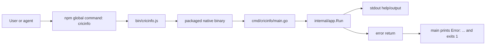
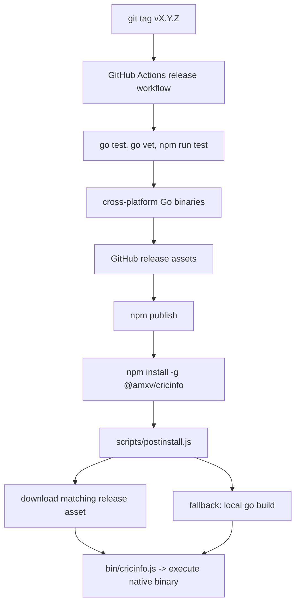
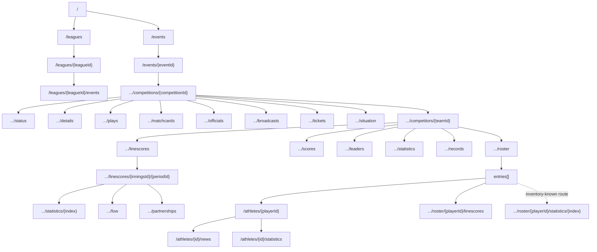
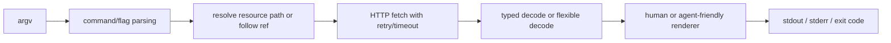
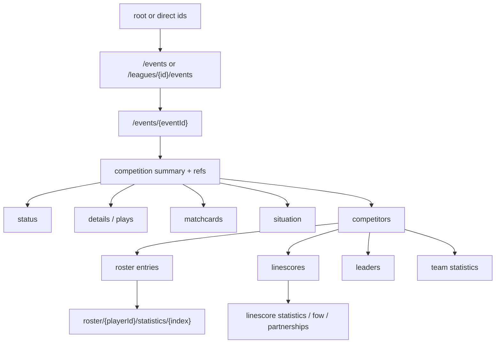

# Cricinfo CLI Foundation Research Report

Date: 2026-04-10  
Repo: `/Users/ashray/code/amxv/cricinfo-cli`

This document supplements the existing API research outputs and is aimed at the next planning agent. It is architecture-first: what exists today, what the public Cricinfo API actually looks like in practice, which repo seams will matter most for a broad-coverage statistics CLI, and which risks are already visible before implementation begins.

## 1. Scope and Evidence

This report is based on:

- Codebase inspection of the current runtime, packaging, build, and release surface.
- Prior research documents:
  - [cricinfo-public-api-guide.md](/Users/ashray/code/amxv/cricinfo-cli/gg/agent-outputs/cricinfo-public-api-guide.md)
  - [cricinfo-api-research-handoff.md](/Users/ashray/code/amxv/cricinfo-cli/gg/agent-outputs/cricinfo-api-research-handoff.md)
- Linked inventory artifacts referenced by those documents:
  - [cricinfo-working-templates.tsv](/Users/ashray/code/amxv/cricinfo-cli/gg/agent-outputs/cricinfo-working-templates.tsv)
  - [cricinfo-working-endpoints.tsv](/Users/ashray/code/amxv/cricinfo-cli/gg/agent-outputs/cricinfo-working-endpoints.tsv)
  - [cricinfo-field-path-catalog.txt](/Users/ashray/code/amxv/cricinfo-cli/gg/agent-outputs/cricinfo-field-path-catalog.txt)
  - [cricinfo-field-path-frequency.tsv](/Users/ashray/code/amxv/cricinfo-cli/gg/agent-outputs/cricinfo-field-path-frequency.tsv)
  - [cricinfo-player-stat-templates.tsv](/Users/ashray/code/amxv/cricinfo-cli/gg/agent-outputs/cricinfo-player-stat-templates.tsv)
  - [cricinfo-player-top-keys-frequency.tsv](/Users/ashray/code/amxv/cricinfo-cli/gg/agent-outputs/cricinfo-player-top-keys-frequency.tsv)
  - [cricinfo-player-item-keys-frequency.tsv](/Users/ashray/code/amxv/cricinfo-cli/gg/agent-outputs/cricinfo-player-item-keys-frequency.tsv)
  - [cricinfo-player-stat-field-paths.txt](/Users/ashray/code/amxv/cricinfo-cli/gg/agent-outputs/cricinfo-player-stat-field-paths.txt)
  - [cricinfo-player-stat-field-frequency.tsv](/Users/ashray/code/amxv/cricinfo-cli/gg/agent-outputs/cricinfo-player-stat-field-frequency.tsv)
- Live spot checks against confirmed public endpoints under `http://core.espnuk.org/v2/sports/cricket`.

Coverage facts inherited from the prior research:

- `526` working URL samples.
- `56` normalized working endpoint templates.
- `2536` unique scalar field paths.
- Focused player pass: `171` player endpoint samples, `167` x `200`, `1` x `404`, `3` x `503`, `8` player-heavy templates.

## 2. Executive Takeaways

- The repository today is a delivery shell, not a Cricinfo client. It has a minimal Go command dispatcher, a Node npm shim, a postinstall downloader/build fallback, and a release workflow, but no HTTP client, no Cricinfo data package, no rendering layer, no fixture suite, and no command hierarchy beyond `hello`.
- The public API surface is broad and heterogeneous. Some resources are paginated envelopes of `$ref` items, some are rich objects, some are object-shaped collections such as roster `entries`, and some are granular ball-by-ball detail records.
- The API is partly hypermedia-driven and partly inventory-driven. Following `$ref` is necessary, but it is not sufficient. Some working routes are absent or null in parent objects, and some returned `$ref` values normalize to a different league path than the one requested.
- The most important current touchpoint in the repo is [internal/app/app.go](/Users/ashray/code/amxv/cricinfo-cli/internal/app/app.go#L15). That file currently owns all command parsing, help output, and stdout writing. A full-featured CLI will either expand it heavily or force a new boundary beneath it.
- The packaging and release contract already matters. Asset naming, binary name, npm shim behavior, and build linker flags are coupled across [package.json](/Users/ashray/code/amxv/cricinfo-cli/package.json#L15), [bin/cricinfo.js](/Users/ashray/code/amxv/cricinfo-cli/bin/cricinfo.js#L7), [scripts/postinstall.js](/Users/ashray/code/amxv/cricinfo-cli/scripts/postinstall.js#L8), [Makefile](/Users/ashray/code/amxv/cricinfo-cli/Makefile#L3), and [release.yml](/Users/ashray/code/amxv/cricinfo-cli/.github/workflows/release.yml#L8).

## 3. Current Repository Architecture

### 3.1 Current file-level map

| Area | Purpose today | Why it matters for the planned product |
| --- | --- | --- |
| [cmd/cricinfo/main.go](/Users/ashray/code/amxv/cricinfo-cli/cmd/cricinfo/main.go#L10) | Native binary entrypoint. Calls `app.Run`, prints `Error:` to `stderr`, exits non-zero on error. | Final process boundary for all future command behavior, error semantics, and machine-readable output concerns. |
| [internal/app/app.go](/Users/ashray/code/amxv/cricinfo-cli/internal/app/app.go#L15) | Manual argument dispatch, help printing, version printing, one `hello` command. | Current command surface owner. Most likely first file to change when real subcommands and global flags arrive. |
| [internal/app/app_test.go](/Users/ashray/code/amxv/cricinfo-cli/internal/app/app_test.go#L9) | Minimal smoke tests around help, version, hello, and unknown command handling. | Current test style is buffer-based command execution. Useful baseline, but far too thin for API-heavy commands. |
| [internal/buildinfo/buildinfo.go](/Users/ashray/code/amxv/cricinfo-cli/internal/buildinfo/buildinfo.go#L5) | Build-time version injection with `dev` fallback. | Central version source for `--version`, release binaries, and reproducible packaging. |
| [bin/cricinfo.js](/Users/ashray/code/amxv/cricinfo-cli/bin/cricinfo.js#L7) | npm executable shim. Resolves packaged native binary and forwards argv. | This is the npm user’s actual entrypoint. Any CLI name or binary layout change must remain compatible here. |
| [scripts/postinstall.js](/Users/ashray/code/amxv/cricinfo-cli/scripts/postinstall.js#L45) | Downloads release asset for current OS/arch; falls back to `go build`. | Primary installation path for npm consumers. Release asset naming and Go fallback contract must stay synchronized. |
| [package.json](/Users/ashray/code/amxv/cricinfo-cli/package.json#L15) | npm package metadata, executable name, scripts, included files. | Defines public npm surface and binary name contract. |
| [Makefile](/Users/ashray/code/amxv/cricinfo-cli/Makefile#L14) | Local dev/build/test/release-tag commands. | Planning agent should treat this as the current operational contract for local verification. |
| [go.mod](/Users/ashray/code/amxv/cricinfo-cli/go.mod#L1) | Module root. No external dependencies yet. | Indicates the Go side is still essentially greenfield. |
| [release workflow](/Users/ashray/code/amxv/cricinfo-cli/.github/workflows/release.yml#L17) | Tag-triggered quality, build, GitHub release, npm publish. | Release semantics and asset naming already exist and must survive a feature-heavy rewrite. |

### 3.2 Current runtime topology

### 3.3 Current release and install topology

## 4. What Exists Today vs What Does Not

### 4.1 Present capabilities

- Process entrypoint and non-zero exit behavior exist.
- Manual root help and `--version` support exist.
- One sample subcommand exists: `hello`.
- Version stamping exists through `internal/buildinfo`.
- npm distribution, GitHub release assets, and local Go fallback install flow exist.

### 4.2 Missing capabilities that matter for a broad Cricinfo CLI

- No HTTP transport layer.
- No retry, timeout, or backoff behavior.
- No `$ref` follower or route resolver.
- No typed Cricinfo domain models.
- No generic paginator abstraction.
- No rendering/output abstraction for human-friendly versus agent-friendly output.
- No flag parsing beyond manual positional inspection.
- No fixture or contract tests against real API payloads.
- No separation between command definition, service layer, transport, and presentation.

That absence is the core architecture fact for planning: this repo already knows how to be shipped, but it does not yet know how to speak Cricinfo.

## 5. Current Command Path and Current Extension Pressure

The present Go command layer is intentionally tiny:

- [app.Run](/Users/ashray/code/amxv/cricinfo-cli/internal/app/app.go#L15) handles all arguments directly.
- Help text is hard-coded by `printRootHelp` and `printHelloHelp` in [internal/app/app.go](/Users/ashray/code/amxv/cricinfo-cli/internal/app/app.go#L60).
- Unknown commands return a formatted error from the same file.
- Tests target the `Run(args, stdout, stderr)` function in [internal/app/app_test.go](/Users/ashray/code/amxv/cricinfo-cli/internal/app/app_test.go#L9).

Implication: any serious command expansion will immediately put pressure on one file that currently combines:

- command routing
- help authoring
- output writing
- argument normalization
- version behavior

For a full API CLI with good help, flags, pagination controls, output formats, and error modes, this is the first and most obvious architectural boundary that will need relief.

## 6. Public API Topology from the Inventories and Live Sampling

### 6.1 Confirmed high-level route families

From the prior inventories and live spot checks, the following route groups are confirmed important:

- Root and discovery:
  - `/`
  - `/events`
  - `/leagues`
  - `/teams/{id}`
  - `/athletes`
  - `/athletes/{id}`
  - `/athletes/{id}/news`
  - `/athletes/{id}/statistics`
- League and event tree:
  - `/leagues/{id}/events`
  - `/leagues/{id}/events/{id}`
  - `/leagues/{id}/events/{id}/competitions/{id}`
  - `/leagues/{id}/events/{id}/competitions/{id}/status`
  - `/leagues/{id}/events/{id}/competitions/{id}/details`
  - `/leagues/{id}/events/{id}/competitions/{id}/details/{id}`
  - `/leagues/{id}/events/{id}/competitions/{id}/plays`
  - `/leagues/{id}/events/{id}/competitions/{id}/matchcards`
  - `/leagues/{id}/events/{id}/competitions/{id}/officials`
  - `/leagues/{id}/events/{id}/competitions/{id}/broadcasts`
  - `/leagues/{id}/events/{id}/competitions/{id}/tickets`
  - `/leagues/{id}/events/{id}/competitions/{id}/odds`
  - `/leagues/{id}/events/{id}/competitions/{id}/situation`
  - `/leagues/{id}/events/{id}/competitions/{id}/situation/odds`
- Competitor and innings depth:
  - `/competitors/{id}`
  - `/competitors/{id}/scores`
  - `/competitors/{id}/roster`
  - `/competitors/{id}/leaders`
  - `/competitors/{id}/statistics`
  - `/competitors/{id}/records`
  - `/competitors/{id}/linescores`
  - `/competitors/{id}/linescores/{inningsId}/{periodId}`
  - `/.../leaders`
  - `/.../statistics/{index}`
  - `/.../fow`
  - `/.../partnerships`
- Player and player-in-match depth:
  - `/athletes/{id}`
  - `/athletes/{id}/news`
  - `/athletes/{id}/statistics`
  - `/leagues/{id}/athletes/{id}`
  - `/roster/{playerId}/linescores`
  - `/roster/{playerId}/statistics/{index}`
  - `/roster/{playerId}/linescores/{inningsId}/{periodId}/statistics/{index}`

### 6.2 Current API graph

## 7. What the Live API Samples Show About Data Shape

### 7.1 Discovery layer

Observed live:

- `GET /` returns a rich object with keys `"$ref", "events", "id", "leagues", "logos", "name", "slug", "uid"`.
- Root exposed `events` and `leagues` as `$ref` objects.
- Root did not expose an `athletes` reference in the live sample even though `/athletes` works.
- `GET /events` and `GET /leagues` are paginated envelopes with `count`, `items`, `pageCount`, `pageIndex`, `pageSize`.
- `GET /events` items can be plain `$ref` stubs.

Planning consequence: discovery is incomplete if you rely only on the root object. `/athletes` and several deeper working routes are inventory-known, not guaranteed to be root-linked.

### 7.2 Event and competition layer

Observed live on `eventId=1529474` and `competitionId=1529474`:

- `GET /events/{id}` returns a rich event object with `competitions`, `date`, `description`, `leagues`, `links`, `season`, `venues`, and other metadata.
- The event’s `competitions[]` array contains embedded competitor summaries plus many deeper `$ref` entry points.
- `GET /.../competitions/{id}` returns a rich competition object with refs to `status`, `details`, `matchcards`, `officials`, `broadcasts`, `tickets`, and `situation`.
- In the sampled competition, `plays` was `null` inside the competition object even though `GET /.../plays` works.
- `GET /.../status` returns a compact status object with `summary`, `longSummary`, `period`, `session`, `dayNumber`, `battingTeamId`, and a `type` object describing state.

Planning consequence: parent objects are helpful, but not complete. A generic client must be comfortable with both following embedded refs and calling working routes that are known from the inventory but absent or null in the parent payload.

### 7.3 Details and plays layer

Observed live:

- `GET /.../details` is a paginated envelope of refs.
- `GET /.../plays?limit=1` returned a paginated envelope whose first item was a ref to `/details/110`.
- `GET /.../details/110` returned a ball-level detail object with keys including `athletesInvolved`, `batsman`, `bowler`, `dismissal`, `homeScore`, `awayScore`, `over`, `period`, `scoreValue`, `text`, `speedKPH`, `xCoordinate`, and `yCoordinate`.

This strongly suggests that `plays` is effectively an index of play/detail refs rather than an entirely separate payload family.

Planning consequence: event-log commands should treat detail records as a first-class primitive, not only as free-form text.

### 7.4 Team and innings layer

Observed live:

- `GET /.../competitors/{teamId}/roster` is not a paginated `items[]` envelope in the sampled route. It is an object with keys `"$ref", "competition", "entries", "team"`.
- `roster.entries[]` includes fields such as `captain`, `playerId`, `starter`, `athlete.$ref`, `position.$ref`, and `linescores.$ref`.
- `GET /.../competitors/{teamId}/linescores` is paginated and each item includes score summary fields plus refs to deeper `statistics`, `leaders`, `partnerships`, and `fow`.
- `GET /.../linescores/{inningsId}/{periodId}/statistics/{index}` returns an object with `competition`, `team`, and an object-shaped `splits` block containing categories and stats.

Planning consequence: “collection” is not a single schema pattern in this API. Roster, linescores, details, and statistics each need shape-aware decode paths.

### 7.5 Athlete layer

Observed live:

- `GET /athletes/{id}` is a rich profile object containing identity, batting/fielding names, styles, team ref, major team refs, news ref, relations, and more.
- `GET /athletes/{id}/statistics` returns keys `"$ref", "athlete", "splits"`.
- `splits` is an object with keys such as `abbreviation`, `categories`, `id`, and `name`.
- `splits.categories[].stats[]` carries both raw `value` and human-friendly `displayValue`.
- Match-context player statistics under `/roster/{playerId}/statistics/{index}` follow the same broad shape: `"$ref", "athlete", "competition", "splits"`.

Planning consequence: player profile and player statistics are distinct resource families and should not be conflated into one model.

## 8. API Behavior Quirks That Matter Architecturally

These are not abstract warnings. They were visible either in the validated inventories or in live spot checks during this pass.

### 8.1 `$ref` is necessary but not sufficient

- The inventories and live payloads clearly rely on `$ref`.
- Some working resources are not advertised consistently. Example: sampled competition object had `plays: null`, but `/plays` still worked.
- Some deeper working player-stat routes are known from the inventory but were not directly advertised on the sampled roster entries.

Implication: the client will need both ref-following behavior and an explicit route vocabulary for known high-value families.

### 8.2 Canonicalization can shift path identity

Observed live:

- Requesting `/leagues/19138/events/1529474/competitions/1529474/status` returned a payload whose `"$ref"` pointed at `/leagues/1174248/events/1529474/competitions/1529474/status`.
- A sampled `linescores` item also returned a `"$ref"` under league `1174248` even though the request path used `19138`.

Implication: callers should not assume the originally requested path remains canonical. The system appears to normalize certain league-linked resources internally.

### 8.3 Some advertised refs or fields can be low-quality

Observed live:

- In one sampled `GET /athletes/1361257/statistics`, the embedded `athlete.$ref` came back as `http://core.espnuk.org/v2/sports/cricket/athletes/` without the athlete ID suffix.

Implication: even when a route returns `200`, every nested ref should not be treated as perfectly trustworthy.

### 8.4 Probe-derived “item key” metadata is best-effort

Observed across artifacts and live re-checks:

- The inventory file [cricinfo-working-endpoints.tsv](/Users/ashray/code/amxv/cricinfo-cli/gg/agent-outputs/cricinfo-working-endpoints.tsv) contains some rows marked `<non-json>`.
- A live re-check of one such sample, `GET /athletes/1090621`, returned valid JSON with `Content-Type: application/json; charset=UTF-8`.

Inference from the evidence: those `<non-json>` markers should be treated as probe-time parsing or extraction artifacts rather than definitive content-type truth.

### 8.5 Transient failures are real

- Prior research already recorded transient `503` responses on some otherwise valid player routes.
- During this pass, the root endpoint returned a transient `503` on the first attempt and succeeded on retry.

Implication: retry and timeout policy is not optional for a good user-facing CLI.

## 9. Inventory Signals That Matter for Coverage Planning

### 9.1 High-frequency route families

From [cricinfo-working-templates.tsv](/Users/ashray/code/amxv/cricinfo-cli/gg/agent-outputs/cricinfo-working-templates.tsv):

- The most frequently observed templates were:
  - `/athletes/{id}`
  - `/athletes/{id}/news`
  - `/leagues/{id}/athletes/{id}`
  - `/leagues/{id}/events/{id}/competitions/{id}/details/{id}`
  - `/leagues/{id}/events/{id}/competitions/{id}/competitors/{id}/roster/{id}/statistics/{n}`

That frequency pattern reinforces three priorities for the product goal:

- player profile coverage
- event-log/detail coverage
- match-context player statistics

### 9.2 High-frequency field groups

From [cricinfo-field-path-frequency.tsv](/Users/ashray/code/amxv/cricinfo-cli/gg/agent-outputs/cricinfo-field-path-frequency.tsv):

- High-frequency identity and linkage fields:
  - `$ref`, `id`, `uid`, `displayName`, `shortName`, `team.$ref`
- High-frequency pagination fields:
  - `count`, `pageCount`, `pageIndex`, `pageSize`
- High-frequency detail fields:
  - `batsman.*`, `bowler.*`, `dismissal.*`, `innings.*`, `period`, `clock`, `bbbTimestamp`

Planning consequence: the next agent should assume three broad decode categories will dominate:

- identity/link objects
- paginated ref lists
- stat/detail payloads

### 9.3 Player-stat shape signals

From [cricinfo-player-stat-templates.tsv](/Users/ashray/code/amxv/cricinfo-cli/gg/agent-outputs/cricinfo-player-stat-templates.tsv) and [cricinfo-player-top-keys-frequency.tsv](/Users/ashray/code/amxv/cricinfo-cli/gg/agent-outputs/cricinfo-player-top-keys-frequency.tsv):

- Player-centric coverage is concentrated around:
  - profile
  - news
  - general athlete statistics
  - league-athlete views
  - match-context roster-player statistics
- Recurrent player-stat keys are:
  - `athlete`
  - `competition`
  - `splits`
  - pagination keys for news/list endpoints

Planning consequence: “player stats” should be treated as a family of split/category payloads, not a flat stat record.

## 10. Likely Existing Touchpoints for a Full-Featured CLI

This section is about where a broad stats CLI will touch the current repo, not about how to implement it.

### 10.1 Existing files that will matter most

- [internal/app/app.go](/Users/ashray/code/amxv/cricinfo-cli/internal/app/app.go#L15)
  - Current command router, help author, and output writer.
  - Any introduction of subcommand groups, global flags, or structured output starts here.
- [internal/app/app_test.go](/Users/ashray/code/amxv/cricinfo-cli/internal/app/app_test.go#L9)
  - Existing test seam for command-level behavior.
  - Likely first place where new command contract tests attach.
- [cmd/cricinfo/main.go](/Users/ashray/code/amxv/cricinfo-cli/cmd/cricinfo/main.go#L10)
  - Current hard-coded `Error:` prefix and exit path.
  - Matters for machine-friendly output and typed error behavior.
- [internal/buildinfo/buildinfo.go](/Users/ashray/code/amxv/cricinfo-cli/internal/buildinfo/buildinfo.go#L5)
  - Stable home for version information across build paths.
- [package.json](/Users/ashray/code/amxv/cricinfo-cli/package.json#L15)
  - Public npm executable name, included files, postinstall hook.
- [bin/cricinfo.js](/Users/ashray/code/amxv/cricinfo-cli/bin/cricinfo.js#L7)
  - npm command forwarding path for every real user.
- [scripts/postinstall.js](/Users/ashray/code/amxv/cricinfo-cli/scripts/postinstall.js#L45)
  - Binary installation contract and fallback build behavior.
- [Makefile](/Users/ashray/code/amxv/cricinfo-cli/Makefile#L29)
  - Current verification/build workflow surface.
- [release workflow](/Users/ashray/code/amxv/cricinfo-cli/.github/workflows/release.yml#L17)
  - Release-time quality gates and binary asset publishing.

### 10.2 Logical boundaries that do not exist yet but are clearly needed

These are not file paths yet. They are missing responsibilities visible from the product goal and the API evidence:

- transport boundary
  - HTTP GET, timeout, retry, backoff, and user-agent policy
- hypermedia boundary
  - `$ref` resolution and canonical path handling
- schema boundary
  - stable models versus flexible raw payloads for unstable areas such as `splits`
- command definition boundary
  - subcommand tree, global flags, local flags, help generation
- output/rendering boundary
  - human-readable summaries versus JSON or raw output for agents
- fixture and contract boundary
  - saved payloads and tolerant decode assertions for live API drift

## 11. Data and Control Flows the Future CLI Must Respect

### 11.1 Runtime control flow

### 11.2 Resource traversal flow for match-heavy commands

### 11.3 Product-level interpretation

For an easy-to-use CLI that is both agent-friendly and human-friendly:

- command discovery and help must mirror the API’s resource families rather than only raw paths
- the fetch layer must survive transient 5xx and partial discoverability
- rendering must preserve enough raw structure for agents while still giving humans concise summaries
- route traversal cannot rely on a single pattern because the API mixes explicit refs, implicit families, and shape changes between nearby endpoints

## 12. Packaging and Release Boundaries Already in Place

The next planning agent should treat packaging and release as first-class architecture, not an afterthought.

### 12.1 Asset and binary name contract

- npm executable name is `cricinfo` in [package.json](/Users/ashray/code/amxv/cricinfo-cli/package.json#L15).
- Build and release binary names are driven by `BIN_NAME` and `CLI_BINARY` in [Makefile](/Users/ashray/code/amxv/cricinfo-cli/Makefile#L5) and [release.yml](/Users/ashray/code/amxv/cricinfo-cli/.github/workflows/release.yml#L11).
- Postinstall downloads assets named like `cricinfo_<goos>_<goarch>[.exe]` in [scripts/postinstall.js](/Users/ashray/code/amxv/cricinfo-cli/scripts/postinstall.js#L54).
- npm runtime expects installed binary names like `bin/cricinfo-bin` or `bin/cricinfo.exe` in [bin/cricinfo.js](/Users/ashray/code/amxv/cricinfo-cli/bin/cricinfo.js#L8).

This means binary layout and release naming are already a contract, not just internal details.

### 12.2 Existing release risks

- The release workflow’s build step uses `-ldflags="-s -w"` in [release.yml](/Users/ashray/code/amxv/cricinfo-cli/.github/workflows/release.yml#L70), but does not inject `internal/buildinfo.Version`.
- Local builds and postinstall fallback builds do inject version flags via [Makefile](/Users/ashray/code/amxv/cricinfo-cli/Makefile#L10) and [scripts/postinstall.js](/Users/ashray/code/amxv/cricinfo-cli/scripts/postinstall.js#L40).

Implication: released GitHub binaries may currently report `dev` while locally built binaries report the package version.

### 12.3 Existing naming drift risk

- [bin/cricinfo.js](/Users/ashray/code/amxv/cricinfo-cli/bin/cricinfo.js#L8) falls back to `"cricinfo-cli"` if `pkg.config.cliBinaryName` is missing.
- [scripts/postinstall.js](/Users/ashray/code/amxv/cricinfo-cli/scripts/postinstall.js#L9) falls back to `"cricinfo"` if that same config is missing.

The current package config hides the mismatch, but the defaults are inconsistent and therefore fragile.

## 13. Risks, Boundaries, and Constraints for Planning

### 13.1 Highest-risk API constraints

- incomplete discoverability through parent objects
- canonical ref normalization across different league paths
- transient `503` responses
- mixed collection shapes
- unstable or low-quality nested refs
- wide schema surface area with `2536` scalar field paths already observed

### 13.2 Highest-risk product constraints

- “cover effectively every piece of information” means the command surface can become unmanageably wide if it mirrors raw endpoints one-to-one without a stronger taxonomy
- human-friendly and agent-friendly output modes pull in different directions unless rendering is a distinct boundary
- standard CLI best practices such as help, flags, pagination options, raw output, and stable error behavior will overload the current single-file parser quickly

### 13.3 Highest-risk repository constraints

- there is no current domain package to absorb API complexity
- there is no current test harness for saved fixtures or tolerant decode
- packaging and release logic are already coupled enough that a rename or layout change can break npm installation if applied incompletely

## 14. Planning-Agent Read Order

If a planning agent picks this up next, the most efficient reading order is:

1. [this report](/Users/ashray/code/amxv/cricinfo-cli/gg/cricinfo-cli-foundation-research-report-2026-04-10.md)
2. [cricinfo-public-api-guide.md](/Users/ashray/code/amxv/cricinfo-cli/gg/agent-outputs/cricinfo-public-api-guide.md)
3. [cricinfo-api-research-handoff.md](/Users/ashray/code/amxv/cricinfo-cli/gg/agent-outputs/cricinfo-api-research-handoff.md)
4. [cricinfo-working-templates.tsv](/Users/ashray/code/amxv/cricinfo-cli/gg/agent-outputs/cricinfo-working-templates.tsv)
5. [internal/app/app.go](/Users/ashray/code/amxv/cricinfo-cli/internal/app/app.go#L15)
6. [scripts/postinstall.js](/Users/ashray/code/amxv/cricinfo-cli/scripts/postinstall.js#L45)
7. [release.yml](/Users/ashray/code/amxv/cricinfo-cli/.github/workflows/release.yml#L17)

## 15. Bottom Line

Today’s repository is a clean but minimal Go CLI distribution scaffold. The research inventories show that the Cricinfo public API already exposes enough breadth and depth to support a serious statistics CLI, but the API shape is not uniform and not fully self-describing. The planning agent should assume that the hard part is not shipping binaries or wiring a basic command. The hard part is designing the missing client, traversal, schema, and rendering boundaries so broad coverage remains navigable, resilient, and testable.
